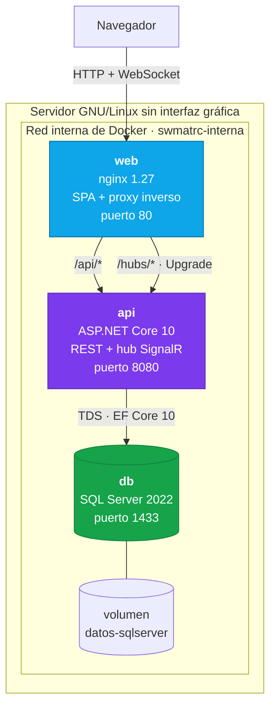
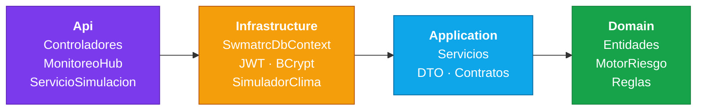
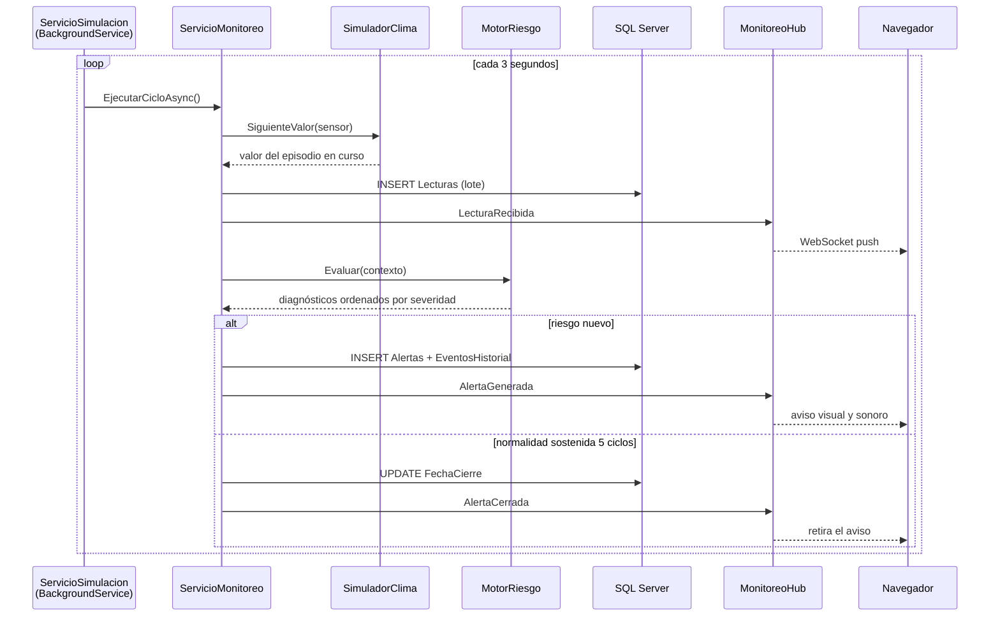
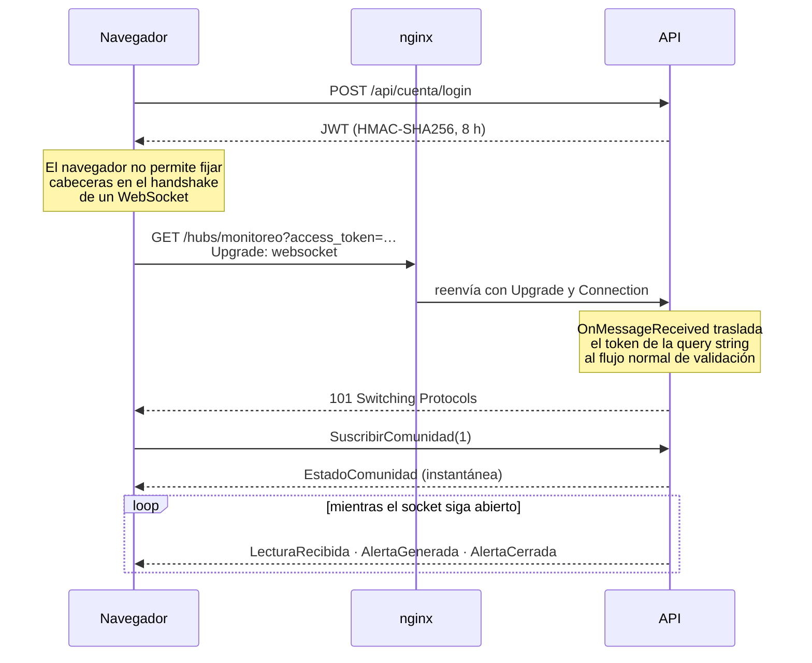

# Arquitectura y modelo de datos

Documento de apoyo al [README](../README.md). Recoge las decisiones de diseño y el
detalle del esquema relacional.

---

## 1. Vista de despliegue

Solo `web` publica un puerto hacia el anfitrión. La API y la base de datos son
alcanzables únicamente desde la red interna: SQL Server nunca queda expuesto a Internet.

---

## 2. Capas del backend

Las dependencias apuntan siempre hacia adentro. El dominio no referencia EF Core ni
ASP.NET, de modo que el motor de riesgo se prueba sin base de datos ni servidor: son las
34 pruebas de `SWMatrc.Domain.Tests`, que corren en menos de 200 ms.

### Inversión de dependencias

Dos interfaces sostienen la flexibilidad del sistema:

| Interfaz | Definida en | Implementada en | Permite sustituir |
|---|---|---|---|
| `ISimuladorClima` | Application | Infrastructure | La simulación por telemetría real de un datalogger |
| `INotificadorTiempoReal` | Application | Api (SignalR) | El transporte del canal en vivo |

La capa de aplicación publica eventos de negocio y desconoce que el transporte concreto
es un WebSocket. Cambiar SignalR por otra tecnología no toca ningún caso de uso.

---

## 3. Ciclo de monitoreo

### Histéresis en el cierre

Una alerta no se retira en cuanto la lectura baja del umbral: debe mantenerse en
normalidad **cinco evaluaciones consecutivas** (unos quince segundos con el ciclo por
omisión). El contador vive en `Alertas.CiclosSinRiesgo`.

Sin esta salvaguarda, un valor oscilando en torno al umbral produce una ráfaga de
aperturas y cierres —y otros tantos asientos en el historial— por puro ruido de medición.
Se comprobó en la primera ejecución del sistema: **56 eventos en un minuto** antes de
introducir la histéresis.

La apertura, en cambio, es inmediata. En alerta temprana un falso positivo cuesta mucho
menos que un aviso tardío.

---

## 4. Modelo de datos

```mermaid
erDiagram
    COMUNIDADES ||--o{ SENSORES : "tiene"
    COMUNIDADES ||--o{ ALERTAS : "registra"
    COMUNIDADES ||--o{ EVENTOSHISTORIAL : "acumula"
    SENSORES ||--o{ LECTURAS : "produce"
    SENSORES |o--o{ ALERTAS : "dispara"
    ALERTAS |o--o{ EVENTOSHISTORIAL : "origina"
    USUARIOS |o--o{ ALERTAS : "reconoce"
    USUARIOS |o--o{ BITACORA : "ejecuta"

    COMUNIDADES {
        int Id PK
        nvarchar Nombre UK
        decimal Latitud
        decimal Longitud
        int Poblacion
        bit Activa
    }

    SENSORES {
        int Id PK
        int ComunidadId FK
        nvarchar Codigo UK
        int Tipo
        int Estado
        decimal ValorActual "desnormalizado"
        decimal UmbralAmarilloAlto
        decimal UmbralNaranjaAlto
        decimal UmbralRojoAlto
        decimal UmbralAmarilloBajo
        decimal UmbralNaranjaBajo
        decimal UmbralRojoBajo
    }

    LECTURAS {
        bigint Id PK
        int SensorId FK
        decimal Valor
        datetime2 FechaHora
    }

    ALERTAS {
        int Id PK
        int ComunidadId FK
        int SensorId FK "nulo"
        int Nivel
        int Fenomeno
        nvarchar Mensaje
        datetime2 FechaCierre "nulo = abierta"
        int CiclosSinRiesgo
        bit Reconocida
        int ReconocidaPorUsuarioId FK
    }

    EVENTOSHISTORIAL {
        int Id PK
        int ComunidadId FK
        int AlertaId FK "nulo"
        int Fenomeno
        int NivelMaximo
        nvarchar OrigenSensor "copiado"
        datetime2 FechaInicio
        datetime2 FechaFin
    }

    USUARIOS {
        int Id PK
        nvarchar Email UK
        nvarchar PasswordHash "BCrypt f12"
        int Rol
        bit Activo
    }

    BITACORA {
        bigint Id PK
        int UsuarioId FK "nulo"
        nvarchar UsuarioEmail "copiado"
        nvarchar Accion
        nvarchar Detalle "JSON"
        nvarchar DireccionIp
        datetime2 FechaHora
    }
```

### Índices

| Índice | Tabla | Motivo |
|---|---|---|
| `IX_Alertas_Abiertas` | Alertas | Índice **filtrado** por `FechaCierre IS NULL`. El tablero consulta las alertas abiertas en cada evaluación; son una fracción mínima del total acumulado. |
| `(SensorId, FechaHora DESC)` | Lecturas | Cubre exactamente la consulta de los gráficos sobre la tabla de mayor crecimiento. |
| `(ComunidadId, FechaInicio DESC)` | EventosHistorial | Orden natural del historial. |
| `Codigo` único | Sensores | El código es el identificador de inventario visible al operador. |
| `Email` único | Usuarios | Credencial de acceso; se exige en el motor, no solo en la aplicación. |

### Desnormalización deliberada

| Campo | Duplica | Por qué |
|---|---|---|
| `Sensores.ValorActual` | Última lectura | El tablero y el motor de riesgo se ejecutan cada 3 s; recorrer el histórico en cada ciclo sería innecesariamente costoso. |
| `EventosHistorial.OrigenSensor` | Código y nombre del sensor | El historial debe seguir siendo legible aunque el sensor se dé de baja. |
| `Bitacora.UsuarioEmail` | Correo del usuario | La auditoría conserva el rastro aunque la cuenta desaparezca. |

### Reglas de borrado

SQL Server rechaza dos rutas de borrado en cascada que alcancen la misma tabla, y
`Comunidades` llega a `Alertas` por dos caminos: directamente y a través de `Sensores`.

La resolución no es solo técnica, también es correcta desde el negocio:

| Relación | Comportamiento | Razón |
|---|---|---|
| `Comunidades → Sensores` | Cascade | Dar de baja una comunidad retira su red. |
| `Comunidades → Alertas` | Cascade | Ruta principal. |
| `Sensores → Alertas` | NoAction | Las alertas son evidencia; no se borran por un cambio de inventario. La baja de un sensor desata la referencia de forma explícita. |
| `Alertas → EventosHistorial` | NoAction | El historial sobrevive a la depuración de alertas antiguas. |
| `Usuarios → Bitacora` | NoAction | La pista de auditoría no se pierde con la cuenta. |

---

## 5. Seguridad del canal en tiempo real

El servidor acepta **exclusivamente** el transporte WebSocket y el cliente omite la
negociación previa. No hay degradación a long polling: el canal es un socket permanente o
no hay canal.

Los mensajes se difunden por grupo de comunidad, de modo que sumar comunidades no
aumenta el ancho de banda que consume cada cliente.

---

## 6. Escalabilidad

| Eje | Cómo se resuelve |
|---|---|
| **Más sensores** | `Sensor` lleva sus propios umbrales y su plantilla de calibración. Alta desde la interfaz, sin tocar código ni esquema. |
| **Más comunidades** | `Comunidad` es la unidad de agrupación. Las consultas, las alertas y los grupos del hub ya están particionados por ella. |
| **Más fenómenos** | Una clase que implemente `IReglaRiesgo` más una línea de registro. El motor y las reglas existentes no cambian. |
| **Más usuarios conectados** | El hub difunde por grupo. Para varias instancias de API haría falta un backplane (Redis), que SignalR admite sin cambios en el código de aplicación. |
| **Volumen de lecturas** | La tabla es estrecha y está indexada por `(SensorId, FechaHora DESC)`. Para retención larga, particionar por fecha o archivar en frío. |
